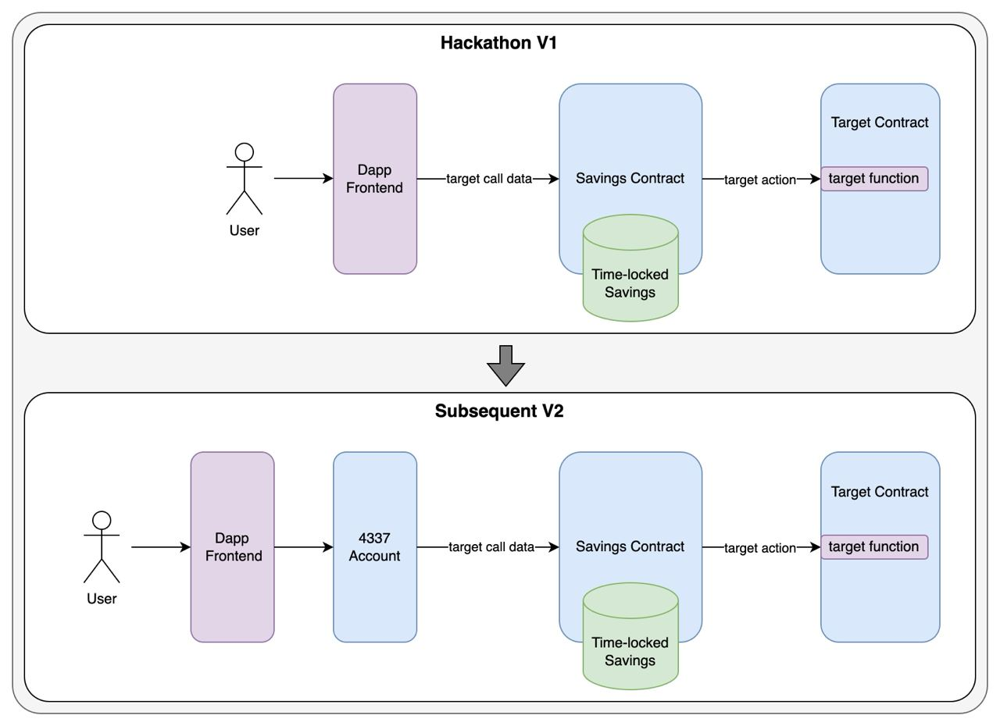

# Auto HODL

Auto HODL is a consumer DeFi framework for automatically saving a small amount of tokens as users perform their normal on-chain activity. In other words, Auto HODL is an on-chain equivalent of [Acorns](https://www.acorns.com/) and other round-up savings tools.

[ETH Denver 2024 presentation](https://docs.google.com/presentation/d/1a946eixqBip8SjOVe2Uf69EXOgODFZ3A_THlTs5XUBc/edit?usp=sharing)

## Architecture

### Terminology

-   **Consumer dApp**: dApp UI that the end user wants to interact with. This might be uniswap.com, the Metamask interface for transferring ERC20, or any other UI that talks to the blockchain.
-   **Savings Contract**: The on-chain contract that all the user's transactions passes through.
-   **Target Contract**: The on-chain component of the Consumer dApp.
-   **Unlock Date**: The user defined date after which savings can be withdrawn.

### User flow

1. Alice sets up a Savings Contract and defines how much she wants to put in to savings for every transaction and what the Lockup Period will be.
1. Alice wants to do a swap on the Target Contract, 1inch, for 100 USDC to ETH
1. Auto HODL intercepts Alice's transaction and asks for a small amount of additional token before Alice signs the transaction.
1. The transaction is sent to the Savings Contract which deposits the extra amount into savings.
1. The Savings Contract forwards the swap request to the Target Contract (1inch) which processes the transaction normally.
1. After the Unlock Date, Alice can withdraw all her savings.

### Diagram

This code currently implements v1 in the diagram below. In the future, we plan on streamlining by integrating with Metamask snaps and 4337 account abstraction.



## Getting started

### 1. Deploy contracts

```sh
$ cd backend
$ forge build
$ HODL_DEPLOY_KEY='XXX'

# Deploy Savings Contract
$ forge create src/Factory.sol:Factory \
    --private-key $HODL_DEPLOY_KEY \
    --rpc-url https://example.com

# Deploy sample Target Contract
$ forge create src/Counter.sol:Counter \
    --private-key $HODL_DEPLOY_KEY \
    --rpc-url https://example.com
```

### 2. Run sample dApp

```sh
$ cd interface
$ yarn
$ yarn dev
```

## Deployed Savings Contracts

| Network   | Environment | Address                                                                                                                                      |
| --------- | ----------- | -------------------------------------------------------------------------------------------------------------------------------------------- |
| Base      | Mainnet     | [0xf312F04DF2885Ec7C44cde77bAC8BB8B1FB4Aa20](https://basescan.org/address/0xf312f04df2885ec7c44cde77bac8bb8b1fb4aa20)                        |
| Inco      | Testnet     | [0xF6c8EED3bE03a482Fe5d43c4EFC330d14dB7cfA4](https://explorer.testnet.inco.org/address/0xF6c8EED3bE03a482Fe5d43c4EFC330d14dB7cfA4)           |
| Fhenix    | Testnet     | [0xF6c8EED3bE03a482Fe5d43c4EFC330d14dB7cfA4](https://explorer.testnet.fhenix.zone/address/0xF6c8EED3bE03a482Fe5d43c4EFC330d14dB7cfA4)        |
| Arbitrum  | Testnet     | [0xF6c8EED3bE03a482Fe5d43c4EFC330d14dB7cfA4](https://sepolia.arbiscan.io/address/0xF6c8EED3bE03a482Fe5d43c4EFC330d14dB7cfA4)                 |
| Linea     | Mainnet     | [0xF6c8EED3bE03a482Fe5d43c4EFC330d14dB7cfA4](https://lineascan.build/address/0xF6c8EED3bE03a482Fe5d43c4EFC330d14dB7cfA4)                     |
| XDC       | Testnet     | [0xF6c8EED3bE03a482Fe5d43c4EFC330d14dB7cfA4](https://apothem.blocksscan.io/address/xdcf6c8eed3be03a482fe5d43c4efc330d14db7cfa4#transactions) |
| Injective | Testnet     | [0xa52b8D81C2A8673C704a35557E6a8B8791fC3506](https://testnet.explorer.injective.network/account/inj1554cmqwz4pnncuz2x42hu65ts7glcdgxycyy7m/) |

## Deployed Target Contracts

| Network   | Environment | Address                                                                                                                                      |
| --------- | ----------- | -------------------------------------------------------------------------------------------------------------------------------------------- |
| Base      | Mainnet     | [0x94789011AcF3c7411d1db9Abe8337f4BA7589D9f](https://basescan.org/address/0x94789011AcF3c7411d1db9Abe8337f4BA7589D9f)                        |
| Inco      | Testnet     | [0xf312F04DF2885Ec7C44cde77bAC8BB8B1FB4Aa20](https://explorer.testnet.inco.org/address/0xf312F04DF2885Ec7C44cde77bAC8BB8B1FB4Aa20)           |
| Fhenix    | Testnet     | [0x94789011AcF3c7411d1db9Abe8337f4BA7589D9f](https://explorer.testnet.fhenix.zone/address/0x94789011AcF3c7411d1db9Abe8337f4BA7589D9f)        |
| Arbitrum  | Testnet     | [0xf312F04DF2885Ec7C44cde77bAC8BB8B1FB4Aa20](https://sepolia.arbiscan.io/address/0xf312f04df2885ec7c44cde77bac8bb8b1fb4aa20)                 |
| Linea     | Mainnet     | [0xf312F04DF2885Ec7C44cde77bAC8BB8B1FB4Aa20](https://lineascan.build/address/0xf312F04DF2885Ec7C44cde77bAC8BB8B1FB4Aa20)                     |
| XDC       | Testnet     | [0x94789011AcF3c7411d1db9Abe8337f4BA7589D9f](https://apothem.blocksscan.io/address/xdc94789011acf3c7411d1db9abe8337f4ba7589d9f#transactions) |
| Injective | Testnet     | [0x144E52b74F837F5529b0c41e900BB5c61d30afb4](https://testnet.explorer.injective.network/account/inj1z3899d60sdl422dscs0fqza4ccwnpta5xw4pcc/) |
